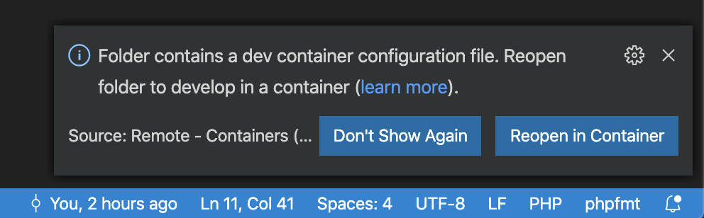

# WTIS - Beroepsproduct

## sql container starten
1. open `/rdmns` in vs code
2. Op een gegeven moment krijg je de vraag of je de dev container binnen deze map wilt activeren.

### netflex server installeren
1. gebruik Microsoft SQL Server management studio om in te loggen op `localhost` met gebruikersnaam `sa` en het wachtwoord staat in `password_rdbms_admin.txt`
2. open en uitvoeren: `/rdmns/database/create_netflex_db.sql`
3. open en uitvoeren: `/rdmns/database/insert_netflex_db.sql`

## php server container starten
1. open `/webserver` in vs code
2. Op een gegeven moment krijg je de vraag of je de dev container binnen deze map wilt activeren.

### Website bekijken
website wordt gehost op [localhost](http://localhost)
